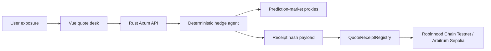

# Architecture

## Boundaries

- The web app is the operator console and demo surface.
- The Rust API owns risk classification, market matching, quote math, and receipt payload generation.
- The Solidity contract stores only receipt metadata and hashes.
- No module signs trades, takes custody, manages user funds, or claims to issue insurance.

## Receipt flow

1. User submits an exposure.
2. API returns a quote and deterministic Solidity arguments.
3. Demo operator submits those arguments to `QuoteReceiptRegistry.createReceipt`.
4. Anyone can call `isValid(quoteId, quoteHash)` to verify that the quote hash is registered and unexpired.
